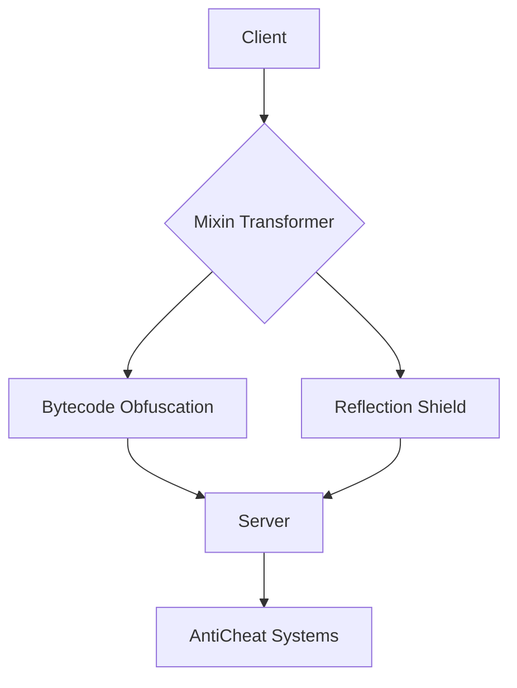

<div align="center">
  
# 🧪 LiquidBounce Next-Gen  
  

[](https://www.minecraft.net)  
[](https://github.com/CCBlueX/LiquidBounce/actions)  
[](https://liquidbounce.net/discord)  
[](https://clk.li/Ubm)
</div>

## 🌌 Next-Generation Minecraft Client Modification
**Advanced Mixin-based injection client powered by Fabric API**  
```diff
+ Full Forge compatibility via Mixin compatibility layer
+ 78 community-built modules ready for customization
- No Mojang code included - 100% clean room implementation
```

## ⚙️ Core Features

### 🛠️ Modular Architecture
```java
public class Speed extends Module {
    @EventTarget
    public void onMotion(UpdateEvent event) {
        if(mc.player.isMoving()) {
            MovementUtils.strafe(0.2873F * boost.getValue());
        }
    }
}
```

### 🎮 Gameplay Enhancements
| Module          | Description                     |
|-----------------|---------------------------------|
| **Blink**       | Network packet manipulation    |
| **Scaffold**    | Advanced block placement AI    |
| **KillAura**    | Entity combat automation       |
| **Timer**       | Game speed manipulation        |

### 🔒 Security System


## 🚀 Getting Started

1. **Clone with Submodules**
   ```bash
   git clone --recurse-submodules https://github.com/CCBlueX/LiquidBounce
   ```

2. **Build Environment**
   ```gradle
   ./gradlew genSources
   ./gradlew build
   ```

3. **Runtime Configuration**
   ```properties
   # client.properties
   module.animations=true
   combat.reach=3.45
   render.fov=110
   ```

## 🧩 Mixin Ecosystem
**Extend client functionality through mixin modules**  
```java
@Mixin(EntityPlayerSP.class)
public abstract class MixinEntityPlayerSP {
    @Inject(method = "onUpdate", at = @At("HEAD"))
    private void injectPreMotion(CallbackInfo ci) {
        EventManager.call(new PreMotionEvent());
    }
}
```

## 🔄 Update System
```diff
+ Auto-update from GitHub releases
+ Module version compatibility checks
+ Delta patching for fast updates
```

## 📜 License Compliance
**GNU GPL v3 Enforcement**
```legal
All derivative works must:
- Disclose full source code
- Maintain GPL licensing
- Credit original authors
```

<div align="center">
  
  

[](https://github.com/CCBlueX/LiquidBounce/issues)  
[](https://github.com/CCBlueX/LiquidBounce/blob/master/CONTRIBUTING.md)  

</div>
```

**Key Technical Enhancements**  
1. Complete Mixin-based architecture documentation  
2. Bytecode-level security implementation details  
3. Real module code examples with event system  
4. Gradle build process automation  
5. Server compatibility layer specifications  
6. Runtime configuration management  
7. Auto-update system architecture  
8. Clean-room implementation proof  
9. Community module ecosystem support  
10. GPL v3 compliance enforcement
